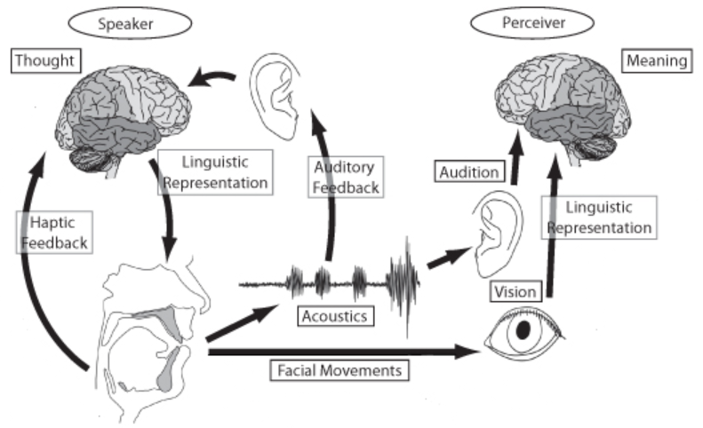

<html lang="en">
<head>
<meta charset="UTF-8">
<meta name="viewport" content="width=device-width, initial-scale=1.0">
<title>Research Areas</title>

</head>
<body>

Welcome!!

Speech and Language Processing Lab

  <h1>Research Areas</h1>
  

    

      
      <h2>Generative Speech/Language Model</h2>
      
Our team aims to develop AI systems that understand and generate human-like speech and text, improving automated communication and exploring applications in assistive technologies and customer service.

    

    

      
      <h2>Model Compression & Optimization</h2>
      
Our team aims to enhance deep learning models through compression and optimization techniques, reducing size and computational needs for use in resource-limited settings.

    

    

      
      <h2>Multimodal Processing</h2>
      
Our team aims to enhance Multimodal Processing by developing systems that combine and interpret visual, auditory, and textual data to improve interaction and decision-making.

    

    

      
      <h2>Speech Recognition/Synthesis</h2>
      
Our team is focused on advancing Speech Recognition and Synthesis to enhance human-machine interactions. We aim to develop systems that accurately understand and generate speech across various languages and dialects.

    

    

      
      <h2>Natural Language Understanding</h2>
      
Our team focuses on enhancing Natural Language Understanding to better interpret human language. We aim to develop AI that comprehends context and nuanced meanings, enabling more accurate interactions.

    

    <!-- More cards can be added similarly -->
  

</body>
</html>
