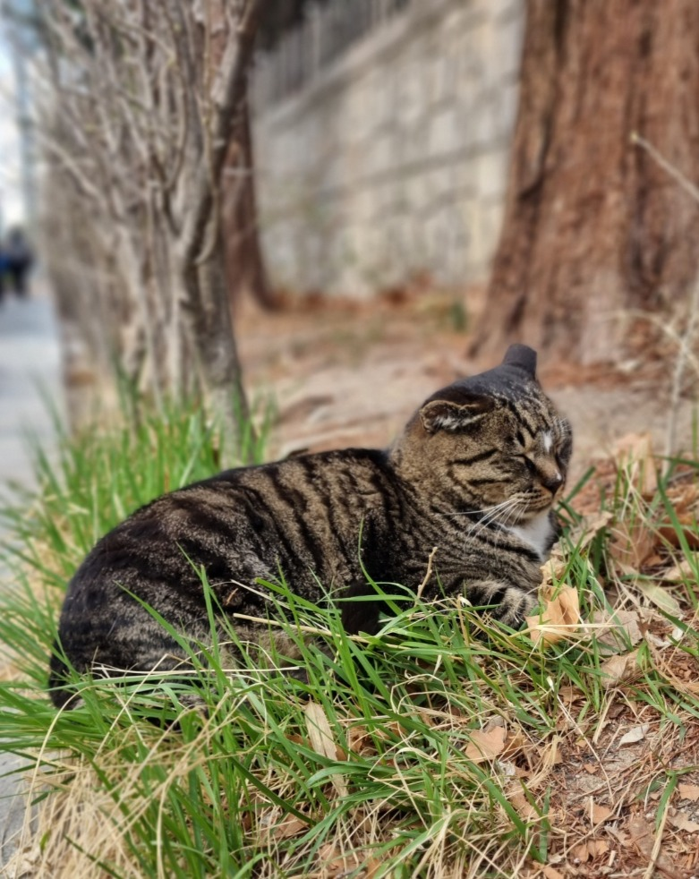
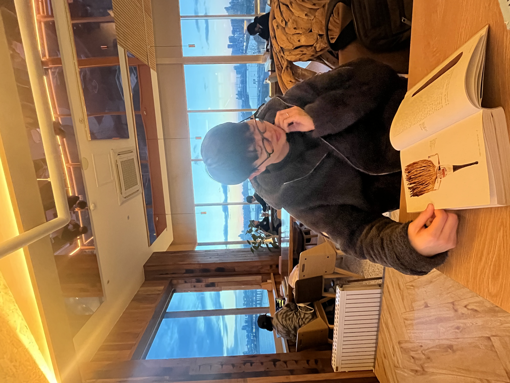
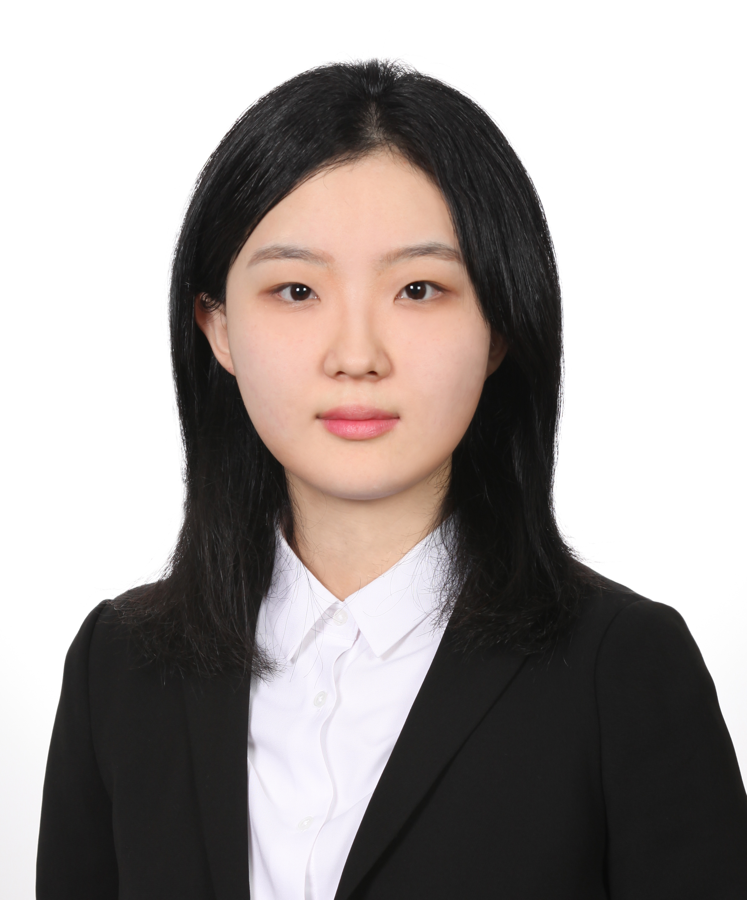
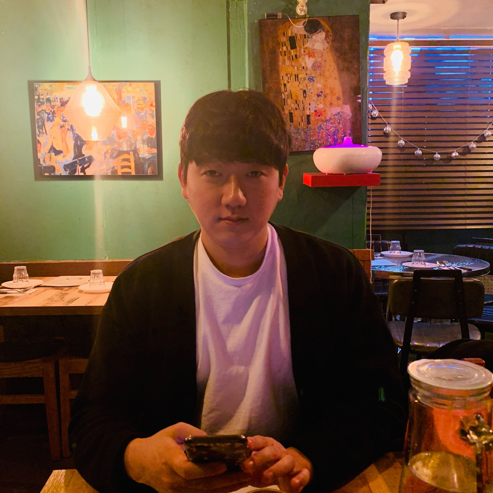
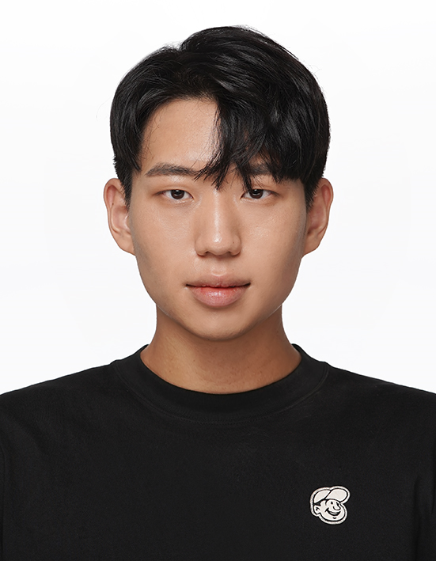
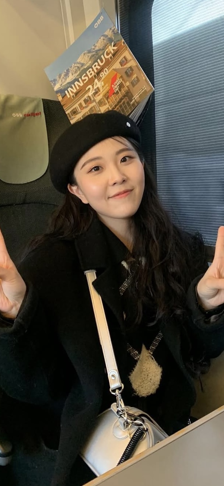
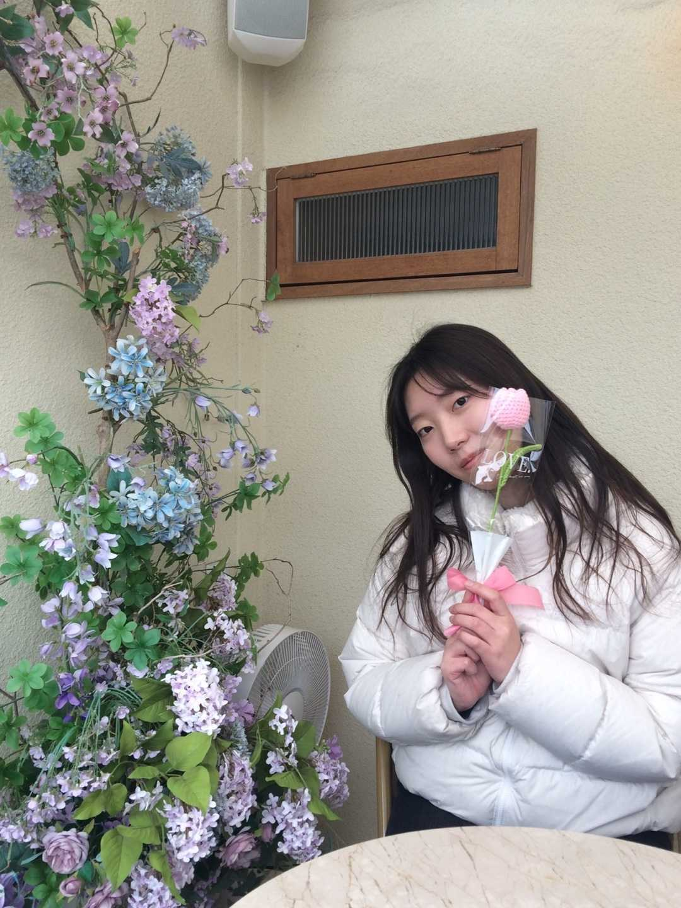
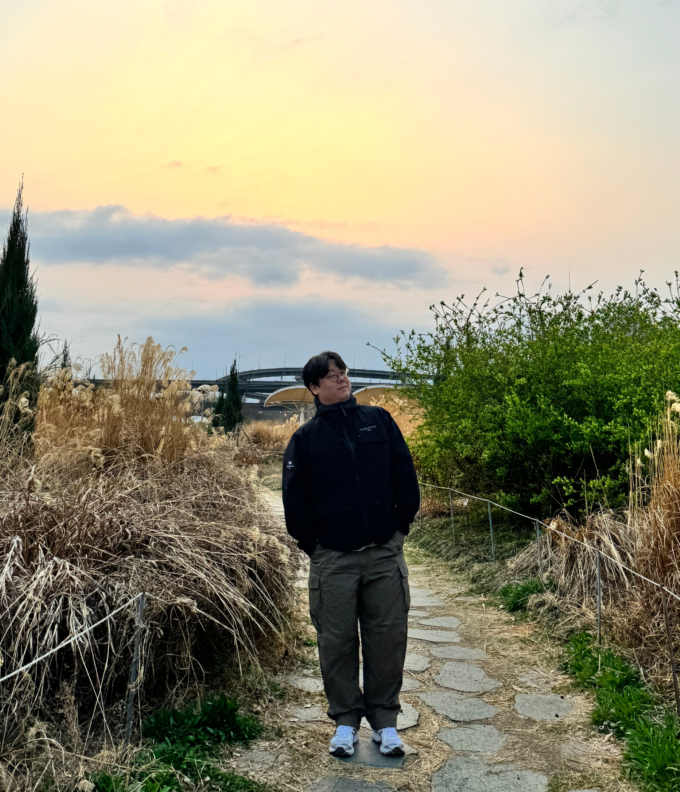

<!-- Members will be added here.

## Professor
### Chanwoo Kim

## Ph. D. Students

## M. S. Students -->

<html lang="en">
<head>
<meta charset="UTF-8">
<meta name="viewport" content="width=device-width, initial-scale=1.0">
<title>Ph.D. Students</title>

</head>
<body>

  <h1>Ph.D. & MS/Pd.D Students</h1>
  

    

      
      

        
Chanwoo Park (박찬우)

        
<strong>Email</strong>: cksdn1290@korea.ac.kr

        <ul>
          <li>Electroencephalography</li>
          <li>Brain-Computer Interface</li>
          <li>Deep Learning</li>
        </ul>
      

    

      

      
      

        
Tahir Sher (타히르)

        
<strong>Email</strong>: tahir2011.iiui@gmail.com

        <ul>
          <li>Generative AI</li>
          <li>AI for healthcare</li>
          <li>Automatic Speech Recognition</li>
        </ul>
      

    

      

      
      

        
Minkyu Cho (조민규)

        
<strong>Email</strong>: minkyucho@korea.ac.kr

        <ul>
          <li>Natural language Generation</li>
          <li>Reinforcement Learning</li>
          <li>LLM</li>
        </ul>
      

    

    <!-- Repeat for other students -->
  

  <h1>Master Students</h1>
    

    

      
      

        
Ireh Kim (김이레)

        
<strong>Email</strong>: 0KimIreh0@gmail.com

        <ul>
          <li>Multimodal</li>
          <li>LLM</li>
          <li>Deep Learning</li>
        </ul>
      

    

    

      
      

        
Enseo Choi (최은서)

        
<strong>Email</strong>: ces4669@korea.ac.kr

        <ul>
          <li>Speech Recognition</li>
          <li>Natural Language Processing</li>
          <li>Spoken Language Understanding</li>
        </ul>
      

    

    

      
      

        
Hyunku Kang (강현구)

        
<strong>Email</strong>: kahk000@korea.ac.kr 

        <ul>
          <li>Speech</li>
          <li>LLM & RAG</li>
          <li>Generative AI</li>
        </ul>
      

    

    

      
      

        
Sungmook Woo (우성묵)

        
<strong>Email</strong>: woomook0524@korea.ac.kr

        <ul>
          <li>Speech Recognition </li>
          <li>LLM </li>
          <li>Deep Learning </li>
        </ul>
      

    

    

      
      

        
 Giyong Kim (김기용)

        
<strong>Email</strong>: deu03216@korea.ac.kr

        <ul>
          <li> Speech Recognition </li>
          <li> Multimodal </li>
          <li> LLM </li>
        </ul>
      

    

        

      
      

        
 Inseop Shin (신인섭)

        
<strong>Email</strong>: vdlstjqn@korea.ac.kr

        <ul>
          <li> Diffusion </li>
          <li> Multimodal </li>
          <li> LLM </li>
        </ul>
      

    

      

      
      

        
Sker Tesia (태시아)

        
<strong>Email</strong>: taesia.sker@gmail.com

        <ul>
          <li>Generative Language Model</li>
          <li>Natural Language Understanding</li>
        </ul>
      

    

    

      
      

        
 Yerin Ryu (류예린)

        
<strong>Email</strong>: yerinryu000@gmail.com 

        <ul>
          <li> Speech Synthesis </li>
          <li> Multimodal </li>
          <li> Generative Model </li>
        </ul>
      

    

    

      
      

        
 Minhee Park (박민희)

        
<strong>Email</strong>: himinsunsine@gmail.com 

        <ul>
          <li> Speech </li>
          <li> Multimodal </li>
          <li> Deep Learning </li>
        </ul>
      

    

    <!-- Repeat for other students -->
  

  <h1>Research Interns</h1>
    

    

      
      

        
 Yanghun Ham (함양훈)

        
<strong>Email</strong>: eric9898@naver.com 

        <ul>
          <li> Multi-modal </li>
          <li> Spoken Language Processing </li>
          <li> LLM </li>
        </ul>
      

    

    <!-- Repeat for other students -->
  

</body>
</html>
