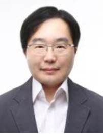

<!-- style default font-size 18 -->
<html lang="en">
<head>
<meta charset="UTF-8">
<meta name="viewport" content="width=device-width, initial-scale=1.0">
<title>Prof. Chan-Woo Kim</title>

</head>
<body>

  
  

    <h1>Prof. Chanwoo Kim</h1>
    <!-- 
<strong>Professor</strong>  -->
    <strong>Dept. of Artificial Intelligence, Korea University</strong>  
    
<strong>Address:</strong> 145 Anam-ro, College of Science Annex Room #217, Seongbuk-gu, Seoul, Korea, 02841 
    <strong>Office:</strong> College of Science Annex Room #217 (이학별관 217호)   
    <strong>Email:</strong> chanwcom@korea.ac.kr 
    <strong>More Info: </strong><a href="https://chanwcom.github.io/">More Information about Professor</a>

  

  

  <h2>Education</h2>
  <ul>
    <li>Ph.D - Language Technologies Institute, School of Computer Science, Carnegie Mellon University (PA), US, 2010</li>
    <li>M.S - School of Electrical Engineering and Computer Science, Seoul National University, KR, 2001</li>
    <li>B.S - School of Electrical Engineering, Seoul National University, KR, 1998</li>
    <li>Seoul Science High School, KR, 1994</li>
  </ul>
  <h2>Experiences</h2>
  <ul>
    <li><strong>2024/03-now</strong> : Professor, Dept. of Artificial Intelligence, Korea University, Seoul, Korea</li>
    <li><strong>2018/02-2023/12</strong> : Executive Vice President (EVP), Samsung Research, Seoul, Korea</li>
    <li><strong>2018/02-2023/12</strong> : Head of Language &amp; Voice Team, Samsung Research, Seoul, Korea</li>
    <li><strong>2013/02-2018/02</strong> : Senior Software Engineer, Google Speech, Moutain View, CA, USA</li>
    <li><strong>2011/01-2013/01</strong> : Speech Scientist, Microsoft Speech, Redmond, WA, USA</li>
    <li><strong>2003/06-2005/08</strong> : Senior Research Engineer, LG Electronics, Seoul, Korea</li>
    <li><strong>2003/03-2003/05</strong> : Research Engineer, SK Teletech, Seoul, Korea</li>
    <li><strong>2000-2002</strong> : Research Engineer, EdumediaTek, Seoul, Korea </li>
  </ul>
  <h2>Awards</h2>
  <ul>
    <li><strong>2023/03  IEEE Spectrum profile article about Dr. Chanwoo Kim's engineering career <a href="https://spectrum.ieee.org/chanwoo-kim-profile">Link to the Article</a> </strong> </li>
    <li><strong>2021/12  Youngest Executive Vice President (EVP) promoted in 2021 at Samsung Electronics among new 68 EVPs for contribution to on-device end-to-end speech recognition </strong></li>
    <li><strong>2019 IEEE Signal Processing Society Best Paper Award (1st author)</strong></li>
    <li><strong>2011.02 : 17-th Samsung Humantech Thesis Bronze prize (1st author)</strong>, ”Power-Normalized
cepstral coefficients for robust speech recognition”.</li>
    <li><strong>2010.02 : 16-th Samsung Hamantech Thesis Honour prize (1st author)</strong>, ”Small power boosting
and spectral subtraction for robust speech recognition”.</li>
    <li><strong>2005.07 : Scholarship for studying abroad 2005 - 2006</strong>, Korea Institute of Energy Evaluation and Planning.</li>
    <li><strong>2005.01 : Research fellowship for Ph. D. study</strong>, 2005 - 2010, Carnegie Mellon University.</li>
    <li><strong>1998.02 : Graduate cum laude</strong>,  Seoul National University</li>
  </ul>
  <h2>Professional Activities</h2>
  <ul>
    <li> General Chair, IEEE Automatic Speech Recognition and Understanding Workshop (ASRU), Dec, 2025. </li>
    <li> TPC Vice Chair, IEEE Int. Conf. Acoust. Speech and Signal Processing (ICASSP), Apr., 2024. </li> 
    <li> Industry Liaison Chair, INTERSPEECH 2022, Sept. 2022 </li>
    <li> Senior Program Committee, AAAI, 2021 </li>
    <li> Session Chair, INTERSPEECH 2020, </li>
  </ul>
  <ul>
    <li><strong>2025/1-  </strong>: Vice Chair, Acoustical Society Of Korea </li>
    <li><strong>2025/1-  </strong>: Vice Chair, IEEE Signal Processing Society Seoul Chapter </li>
    <li><strong>2022/1-2024</strong>: Seoul AI promotion committee </li>
  </ul>
  <h2>Courses</h2>
  
2024 Spring

  <ul>
    <li>XAI509 Automatic Speech Recognition</li>
    <li>XAI604 Automatic Speech Recognition Application And Practice</li>
  </ul>

</body>
</html>
