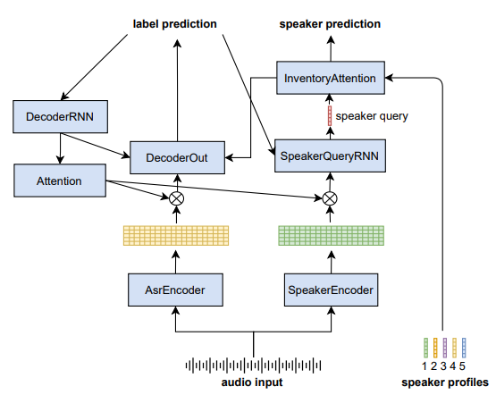
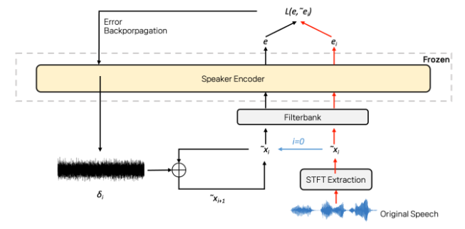

<html lang="en">
<head>
<meta charset="UTF-8">
<meta name="viewport" content="width=device-width, initial-scale=1.0">
<title>Projects Overview</title>

</head>
<body>

  <!-- OKR Table -->
  <table class="okr-table">
    <tr>
      <th>OKR</th>
      <th>Link</th>
    </tr>
    <tr>
      <td>4Q 2024</td>
      <td><a href="https://docs.google.com/spreadsheets/d/1U2NOStfZAYv_JFSqhG1v_Di8rl1TE101bqefWPKfuiI/edit?gid=1476668900#gid=1476668900" target="_blank">4Q 2024</a></td>
    </tr>
    <tr>
      <td>1Q 2025</td>
      <td><a href="https://docs.google.com/spreadsheets/d/1U2NOStfZAYv_JFSqhG1v_Di8rl1TE101bqefWPKfuiI/edit?gid=1476668900#gid=1476668900" target="_blank">Not Updated</a></td>
    </tr>
    <!-- OKR 행 추가 -->
  </table> 
  <h1>Projects</h1>
  

    

      
      

        (LLSOLLU) Speaker Verification & Diarization  
        (PM) Hyunku Kang
      

      
2024.09.02 - 2025.08.31

    

    

      
      

        (9-1-2) Real-time Adversarial Speech Generation   
        (PM) TBD
      

      
2024.10.01 - 2025.09.30

    

    <!-- 프로젝트 카드 추가 -->
  

</body>
</html>

