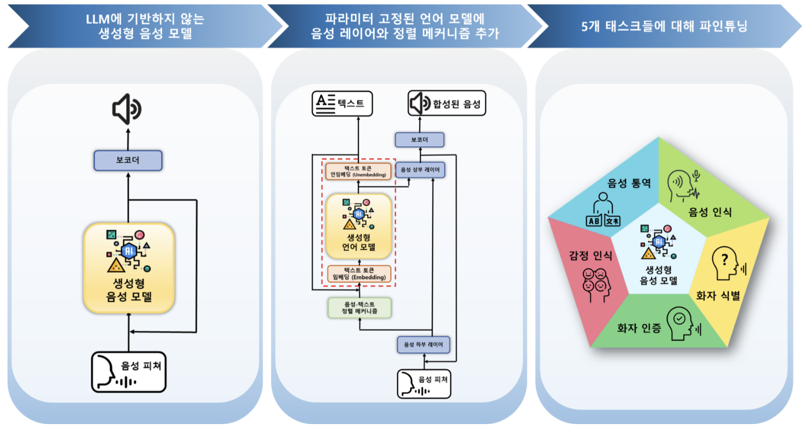
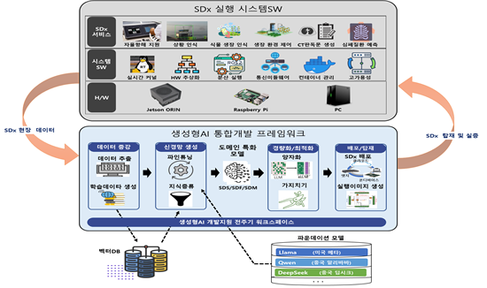
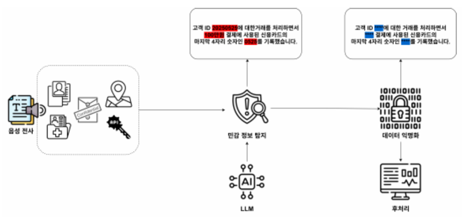
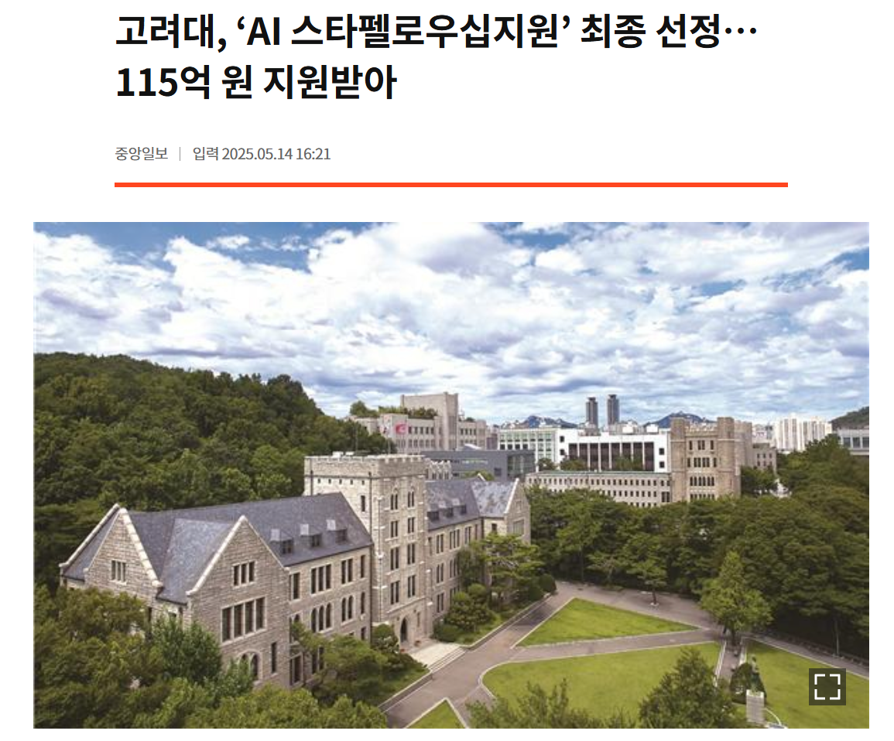
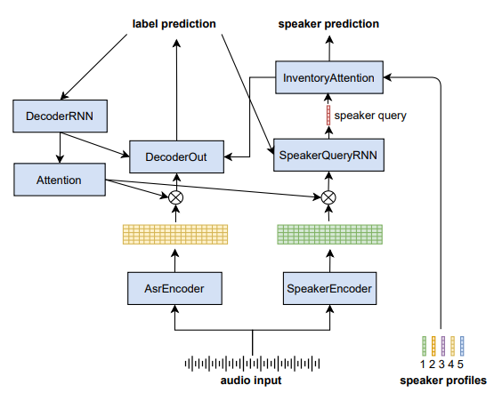
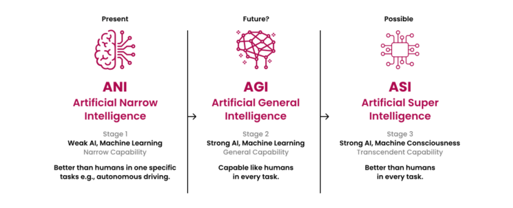
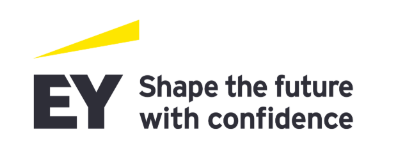
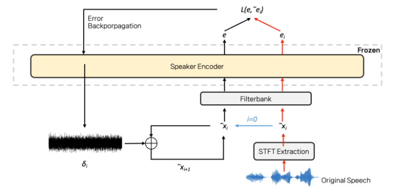

<html lang="en">
<head>
<meta charset="UTF-8">
<meta name="viewport" content="width=device-width, initial-scale=1.0">
<title>Projects Overview</title>

</head>
<body>

  <!-- ── Projects ── -->
  <h1 class="section-title">Projects</h1>

  

  
    

      
      

        
ISM 영어 독서 플랫폼 AI 음성 및 감정 분석 개발

        
아이스크림 미디어

        
2026.02.01 – 2026.7.31

      

    

    

      
      

        
극소량 파인튜닝을 통해 LLM으로부터 구현하는 범용 생성형 음성 모델

        
NRF

        
2025.09.01 – 2026.08.31

      

    

    

      
      

        
SDx 지능형 서비스의 최적 실행을 위한 생성형AI 지원 시스템SW 프레임워크 기술개발

        
IITP

        
2025.07.01 – 2028.12.31

      

    

    

      
      

        
LLM 기반의 민감 정보 탐지를 통해 정보 유출 방지를 위한 알고리즘 개발

        
TIPA

        
2025.05.01 – 2025.12.31

      

    

    

      
      

        
AI Star Fellowship, 사회적 가치 정렬을 내재한 체화된 온디바이스 에이전트

        
IITP

        
2025.04.01 – 2030.12.31

      

    

    

      
      

        
Speaker Verification & Diarization

        
LLSOLLU

        
2024.09.02 – 2025.08.31

      

    

    

      
      

        
ITRC, 자가 인지 및 학습 기반 범용 인공지능 기술 개발

        
IITP

        
2024.07.01 – 2025.12.31

      

    

    

      
      

        
LLM을 활용한 Multi Intent Detection

        
EY 한영회계법인

        
2024.01.01 – 2024.02.28

      

    

    

      
      

        
인공지능 대학원 지원 사업

        
IITP

        
2024.03.01 – 2026.12.31

      

    

    

      
      

        
Real-time Adversarial Speech Generation

        
NRF, 9-1-2

        
2024.10.01 – 2025.01.31

      

    

  
<!-- /.proj-list -->

<!-- /.page-wrapper -->
</body>
</html>
