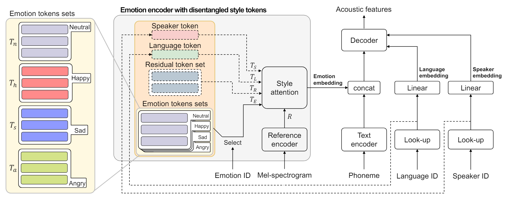
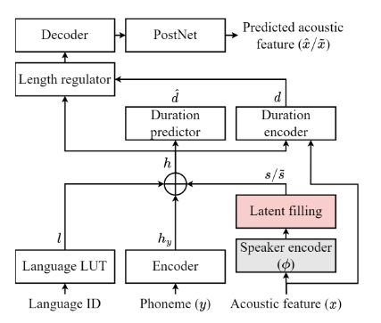
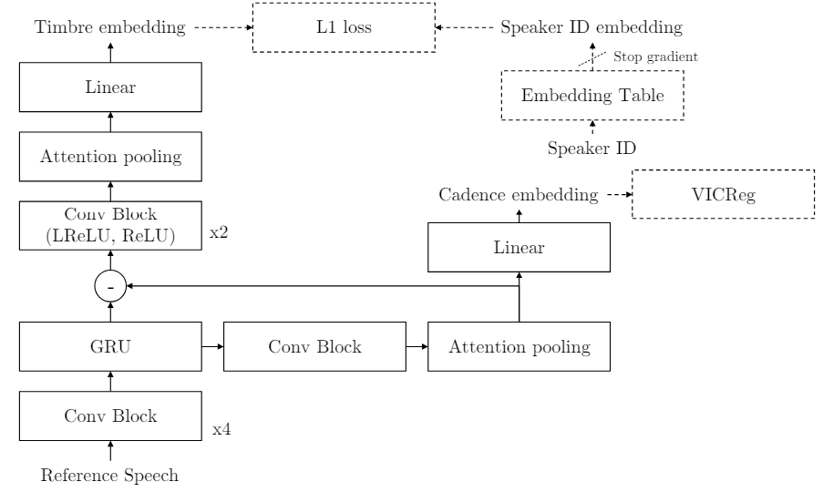
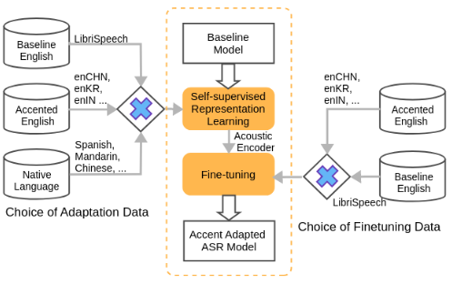
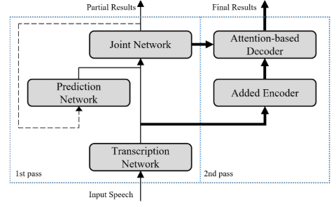

<html lang="en">
<head>
<meta charset="UTF-8">
<meta name="viewport" content="width=device-width, initial-scale=1.0">
<title>Publication Highlights</title>

</head>
<body>
 
<h1>Highlights</h1>

At the end of this page, you can find the full list of publications.

  

    
    <h2>Mels-Tts: Multi-Emotion Multi-Lingual Multi-Speaker Text-To-Speech System Via Disentangled Style Tokens</h2>
    
Heejin Choi, Jae-Sung Bae, Joun Yeop Lee, Seongkyu Mun, Jihwan Lee, Hoon-Young Cho, Chanwoo Kim

    <ul>
      <li>(ICASSP, 2024) IEEE International Conference on Acoustics, Speech and Signal Processing</li>
    </ul>
  

  

    
    <h2>Latent Filling: Latent Space Data Augmentation for Zero-Shot Speech Synthesis</h2>
    
Jae-Sung Bae, Joun Yeop Lee, Ji-Hyun Lee, Seongkyu Mun, Taehwa Kang, Hoon-Young Cho, Chanwoo Kim

    <ul>
      <li>(ICASSP, 2024) IEEE International Conference on Acoustics, Speech and Signal Processing</li>
    </ul>
  

  

    
    <h2>Hierarchical Timbre-Cadence Speaker Encoder for Zero-shot Speech Synthesis</h2>
    
Joun Yeop Lee, Jae-Sung Bae, Seongkyu Mun, Jihwan Lee, Ji-Hyun Lee, Hoon-Young Cho, Chanwoo Kim

    <ul>
      <li>(INTERSPEECH, 2023) INTERSPEECH 2023, 4334-4338</li>
    </ul>
  

    

    
    <h2>Self-Supervised Accent Learning for Under-Resourced Accents Using Native Language Data</h2>
    
Mehul Kumar, Jiyeon Kim, Dhananjaya Gowda, Abhinav Garg, Chanwoo Kim

    <ul>
      <li>(ICASSP, 2023) IEEE International Conference on Acoustics, Speech and Signal Processing</li>
    </ul>
  

  

    
    <h2>Conformer-Based on-Device Streaming Speech Recognition with KD Compression and Two-Pass Architecture</h2>
    
Jinhwan Park, Sichen Jin, Junmo Park, Sungsoo Kim, Dhairya Sandhyana, Changheon Lee, Myoungji Han, Jungin Lee, Seokyeong Jung, Changwoo Han, Chanwoo Kim
    

    <ul>
      <li>(SLT, 2022) IEEE Spoken Language Technology Workshop</li>
    </ul>
  

  <!-- Add more cards as necessary -->

  

  <h1>Full List of Publications</h1>

  
Papers will added here.

 

  <h1>Patents</h1>

  
Patents will added here.

</body>
</html>