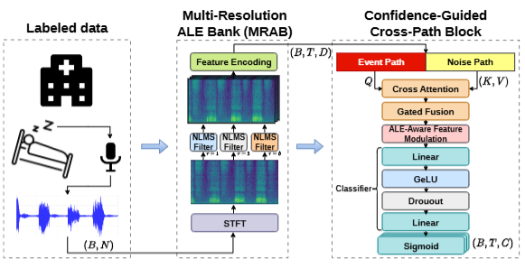
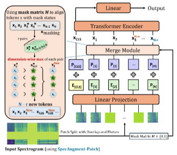
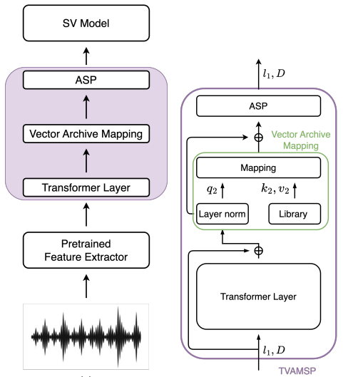
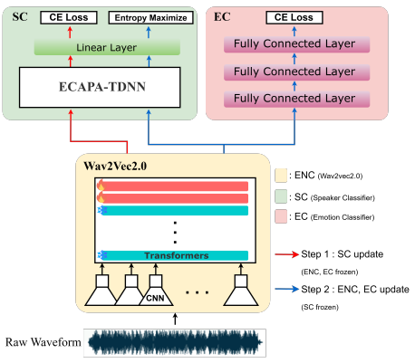
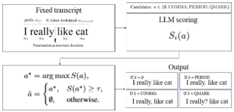

<html lang="en">
<head>
<meta charset="UTF-8">
<meta name="viewport" content="width=device-width, initial-scale=1.0">
<title>Publications</title>

</head>

<body>

  <!-- ── Highlights / Recent Publications ── -->
  <h1 class="section-title">
    Recent Publications
    
      (<a href="https://scholar.google.com/citations?user=pJoZXxYAAAAJ&hl=en&oi=ao"
      >Refer to this Google Scholar Page for the Full List of Publications</a>)
    
  </h1>

  

    
Authors with <u><strong>underlined bold text</strong></u> represent the first authors of the publication.

    
The superscript asterisk (*) indicates the corresponding author.

  

  

    

      
      

        
Sleep Sound Event Detection Powered by Learnable Multi-Resolution Adaptive Line Enhancer

        
Chanwoo Park and Chanwoo Kim*

        
Proc. Interspeech, 2026.

        (The Long Paper Track) - acceptance rate under 30 % 
      

    

    

      
      

        
From Masking to Merging: Rethinking SpecAugment for Efficient Audio Spectrogram Transformer

        
Minhee Park, Hyowon Ahn, and Chanwoo Kim*

        
Proc. Interspeech, 2026.

      

    

    

      
      

        
Beyond Short Segments : Expanding Speaker Embeddings with Vector Archives

        
Hyunku Kang, Minkyu Cho, and Chanwoo Kim*

        
Proc. Interspeech, 2026.

      

    

    

      
      

        
SISER : Speaker Invariant for Speech Emotion Recognition

        
Enseo Choi, Hyunku Kang, and Chanwoo Kim*

        
Proc. Interspeech, 2026.

      

    

    

      
      

        
Efficient Punctuation Restoration via Weighted Lookahead Scoring Method for Streaming ASR Systems

        
Sungmook Woo, Hyunku Kang, and Chanwoo Kim*

        
Proc. IJCNN, 2026.

      

    

    

      
      

        
Enhancing Document-Level Machine Translation via filtered synthetic corpora and two-stage LLM adaptation

        
Ireh Kim, Tesia Sker, and Chanwoo Kim*

        
Proc. ICASSP, 2026.

      

    

    

      
      

        
Controllable Singing Voice Synthesis using Phoneme-Level Energy Sequence

        
Yerin Ryu, Inseop Shin, and Chanwoo Kim*

        
Proc. ASRU, 2025.

      

    

    

      
      

        
A Novel Chain-of-Thought Reasoning Approach for Alzheimer’s Disease Detection Using Large Language and Vision-Language Models

        
Chanwoo Park and Chanwoo Kim*

        

        IEEE Trans. Neural Systems and Rehabilitation Engineering Nov. 2025 (TNSRE)
        (Top 2% in the JCR category of "Rehabilitation")
        

      

    

    

      
      

        
Reasoning-Based Approach with Chain-of-Thought for Alzheimer’s Detection Using Speech and Large Language Models

        
Chanwoo Park, Anna Seo Gyoung Choi, Sunghye Cho and Chanwoo Kim*

        
Proc. Interspeech, 2025.

      

    

    

      
      

        
Wave-U-Mamba: An End-To-End Framework For High-Quality And Efficient Speech Super Resolution

        
Yongjoon Lee and Chanwoo Kim*

        
Proc. ICASSP, 2025.

      

    

    

      
      

        
Mels-Tts: Multi-Emotion Multi-Lingual Multi-Speaker Text-To-Speech System Via Disentangled Style Tokens

        
Heejin Choi, Jae-Sung Bae, Joun Yeop Lee, Seongkyu Mun, Jihwan Lee, Hoon-Young Cho, and Chanwoo Kim*

        
Proc. ICASSP, 2024.

      

    

    

      
      

        
Latent Filling: Latent Space Data Augmentation for Zero-Shot Speech Synthesis

        
Jae-Sung Bae, Joun Yeop Lee, Ji-Hyun Lee, Seongkyu Mun, Taehwa Kang, Hoon-Young Cho, and Chanwoo Kim*

        
Proc. ICASSP, 2024.

      

    

    

      
      

        
Hierarchical Timbre-Cadence Speaker Encoder for Zero-shot Speech Synthesis

        
Joun Yeop Lee, Jae-Sung Bae, Seongkyu Mun, Jihwan Lee, Ji-Hyun Lee, Hoon-Young Cho, and Chanwoo Kim*

        
Proc. INTERSPEECH, 2023.

      

    

    

      
      

        
Self-Supervised Accent Learning for Under-Resourced Accents Using Native Language Data

        
Mehul Kumar, Jiyeon Kim, Dhananjaya Gowda, Abhinav Garg, and Chanwoo Kim*

        
Proc. ICASSP, 2023.

      

    

    

      
      

        
Conformer-Based on-Device Streaming Speech Recognition with KD Compression and Two-Pass Architecture

        
Jinhwan Park, Sichen Jin, Junmo Park, Sungsoo Kim, Dhairya Sandhyana, Changheon Lee, Myoungji Han, Jungin Lee, Seokyeong Jung, Changwoo Han, and Chanwoo Kim*

        
Proc. SLT, 2022.

      

    

    

      
      

        
Macro-Block Dropout for Improved Regularization in Training End-to-End Speech Recognition Models

        
Chanwoo Kim, Sathish Indurti, Jinhwan Park, and Wonyong Sung

        
Proc. SLT, 2022.

      

    

  
<!-- /.pub-list -->

<!-- /.page-wrapper -->
</body>

  

</html>
