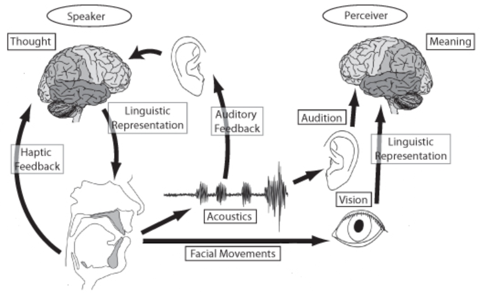

<html lang="en">
<head>
<meta charset="UTF-8">
<meta name="viewport" content="width=device-width, initial-scale=1.0">
<title>Technology Services</title>

</head>
<body>

  

    <h2>1. Generative Speech/Language Model</h2>
    
Researching techniques to engineer AI models that generate text or speech closely resembling human communication.

    <ul class="features-list">
      <li>Analyze and generate language to support coherent and contextually relevant dialogue.</li>
      <li>Automate the production of diverse textual content with minimal human input.</li>
      <li>Maintain accuracy, style, and cultural context across translations between languages.</li>
      <li>Assess emotional tone from text for enhanced consumer insights and decision-making.</li>
    </ul>
  

  

    
  

  

    <h2>2. Model Compression & Optimization</h2>
    
Developing methods to reduce the size and computational demands of AI models while preserving or enhancing their performance.

    <ul class="features-list">
      <li>Remove redundant or non-contributory parameters from models to streamline processing without sacrificing accuracy.</li>
      <li>Reduce the precision of the numerical values in models to lower memory usage and speed up inference.</li>
      <li>Transfer knowledge from large, complex models to smaller, more efficient models to retain effectiveness with less resource consumption.</li>
    </ul>
  

  

    
  

  

    <h2>3. Multimodal Processing</h2>
    
Investigating approaches to integrate and analyze data from multiple sensory modes to improve AI's interpretation and response accuracy.

    <ul class="features-list">
      <li>Combine information from different modalities, such as visual, auditory, and textual, to enhance decision-making processes.</li>
      <li>Develop shared representations that capture the essence of multiple modalities, facilitating better learning and prediction.</li>
      <li>Study how different data types interact and influence each other to refine AI's comprehension and output relevance.</li>
    </ul>
  

  

    
  

  

    <h2>4. Speech Recognition/Synthesis</h2>
    
Exploring techniques to accurately transcribe spoken language into text and generate spoken language from text, aiming to mirror natural human speech.

    <ul class="features-list">
      <li>Construct models that map audio signals to phonetic units, crucial for understanding spoken words.</li>
      <li>Develop models to predict the probability of sequences of words, enhancing the fluency and accuracy of generated text and speech.</li>
      <li>Create synthetic speech that sounds natural by manipulating tone, intonation, and rhythm.</li>
    </ul>
  
  
  

    
  

  

    <h2>5. Natural Language Understanding</h2>
    
Advancing methods to enable AI systems to comprehend, interpret, and reason about human language in a manner that mirrors human understanding.

    <ul class="features-list">
      <li>Break down and analyze the structure of sentences to grasp their meaning and relationships between concepts.</li>
      <li>Examine the broader context in which language is used to accurately infer the intended message and nuances.</li>
      <li>Identify and categorize key elements within text and understand their interrelationships.</li>
    </ul>
  

  

    
  

</body>
</html>